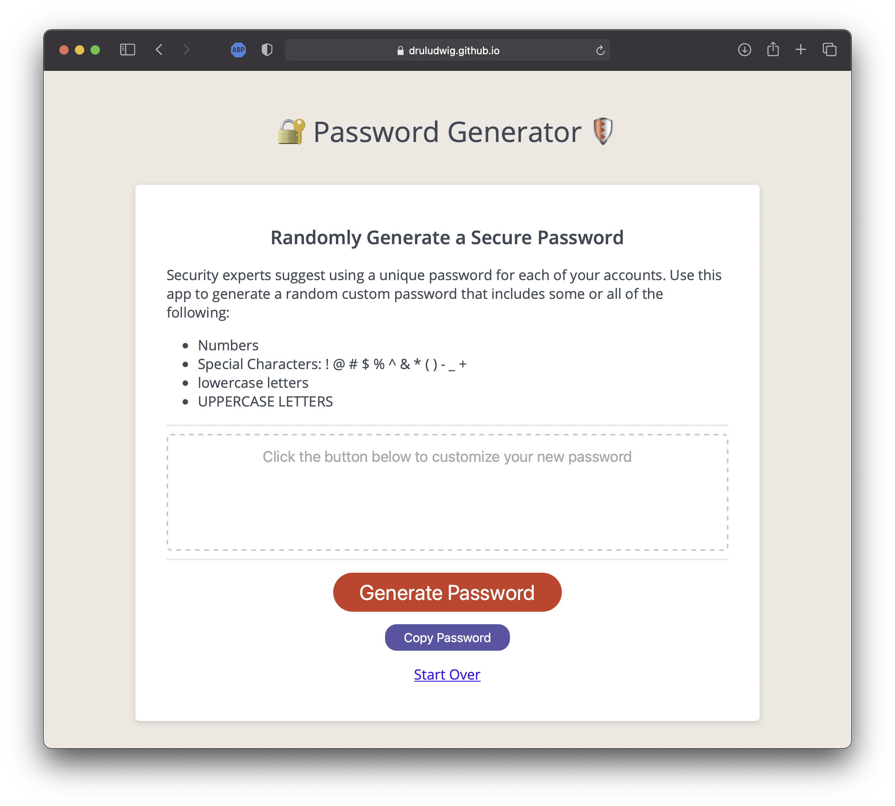
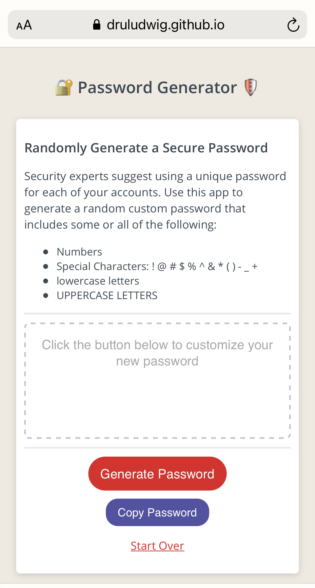

# Custom Password Generator
 
## Description
Security experts suggest using a unique password for each of your accounts. This random password generator app creates a random custom password that may include some or all of the following:

- UPPERCASE LETTERS
- lowercase letters
- Numbers
- Special Characters: ! @ # $ % ^ & * ( ) - _ +

## User Friendly Features
- Validates the character count input to keep the variable in range from 8 to 128. The app rounds the input to the nearest available option instead of popping an error message and stopping their progress. 
- If the user declines the first three format options (lowercase letters, special characters, and numbers), then the app will autoselect the UPPERCASE option to keep the user moving forward.
- Updated the placeholder text to provide user guidiance.
- Made considerable adaptations to the mobile UI.

## Testing Error Traps
- Try entering a character value under 8 or above 128.
- Try clicking cancel at every prompt. The app will still generate a default 8 character all CAPS password. 

## Desktop Version

## Mobile Version
